# SocialTalk_

## Description

The SocialTalk application is a functional backend of a potential social networking app. The app utilizes MongoDb and has CRUD capabilities for working with users, thoughts, and reactions within the social network.

The app follows the below requirements:

```md
GIVEN a social network API
WHEN I enter the command to invoke the application
THEN my server is started and the Mongoose models are synced to the MongoDB database
WHEN I open API GET routes in Insomnia for users and thoughts
THEN the data for each of these routes is displayed in a formatted JSON
WHEN I test API POST, PUT, and DELETE routes in Insomnia
THEN I am able to successfully create, update, and delete users and thoughts in my database
WHEN I test API POST and DELETE routes in Insomnia
THEN I am able to successfully create and delete reactions to thoughts and add and remove friends to a user’s friend list
```

## Table of Contents
- [Installation](#installation)
- [Usage](#usage)
- [Walkthrough](#walkthrough)
- [Screenshots](#screenshots)

## Installation

1. Clone repo,
2. run `npm i` to initialize package.json,
3. start program using node index.js or npm run,
4. Use a backend tool such as Insomnia to test functionality of all routes, server is hosted on prot 3001.

## usage

The app allows for the creation, updating, and deletion of new users.  Users can be assigned friends within the app, the friends must also be users.  Thoughts can be created for given users, and reactions to these thoughts can be generated as well.  The thoughts and reactions can be updated and/or deleted.

## Walkthrough

A video of the app functionality on Insomnia can be seen by following the below link.

[Tutorial Video](https://drive.google.com/file/d/1-aC1ew_oCsNf-mXWPOi7RrUliDqXajWt/view)

## Screenshots

get Users
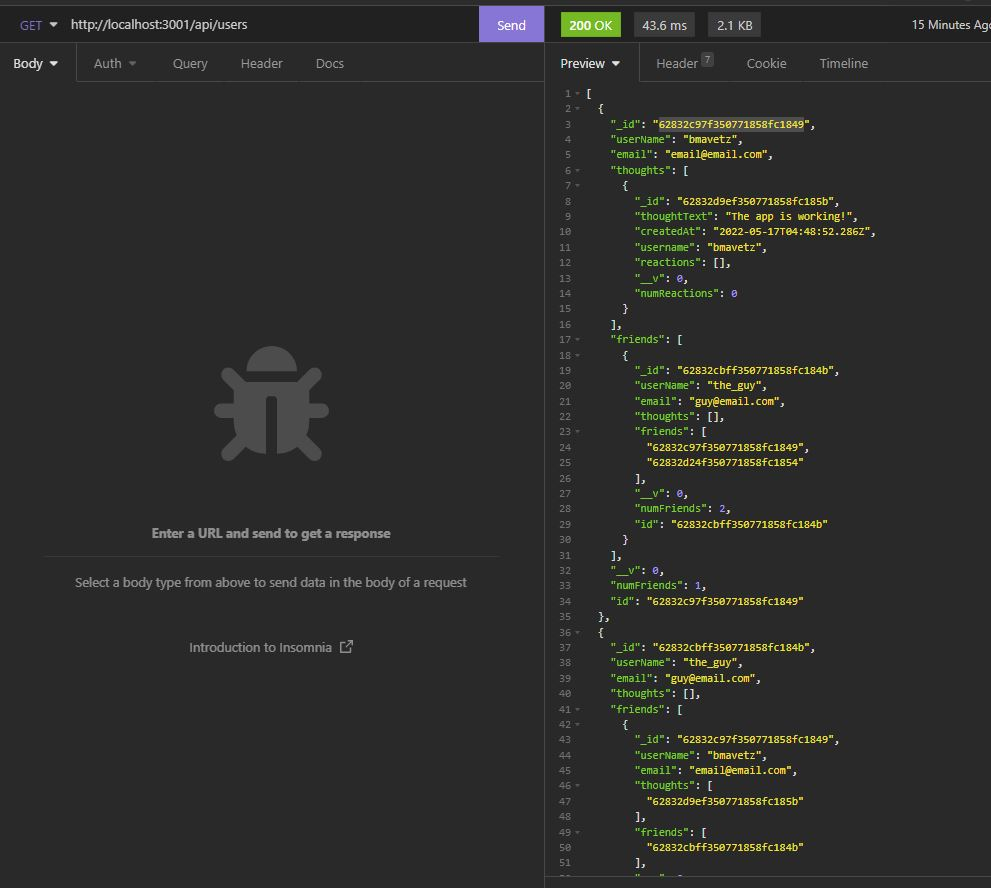

get single user
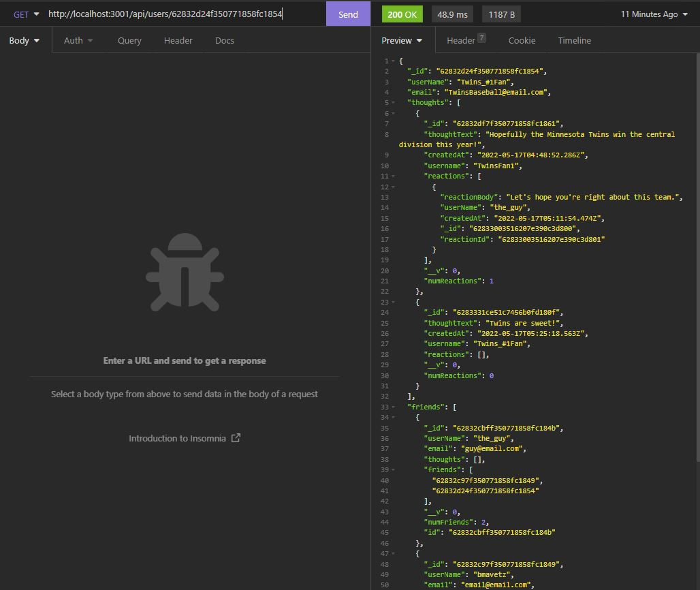

create user
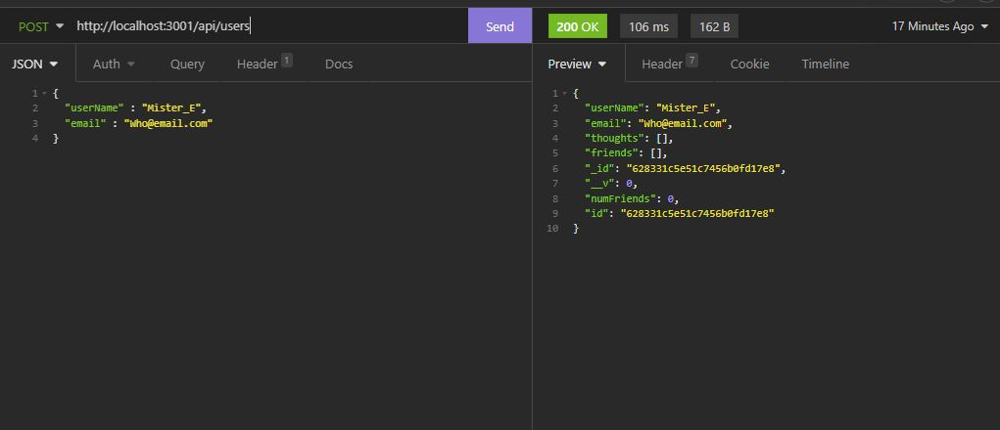

update user


delete user
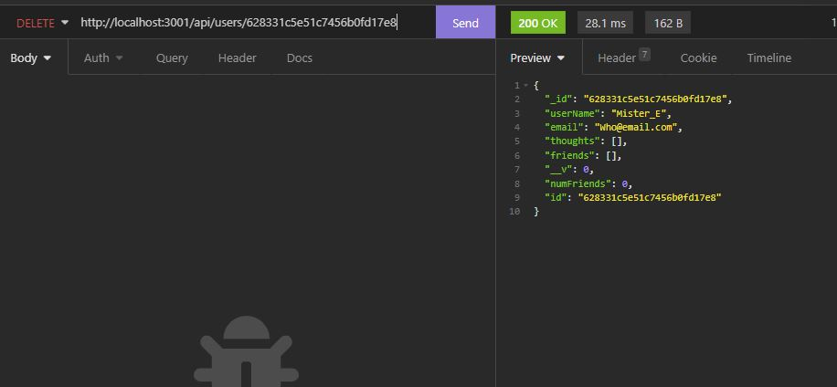

add friend
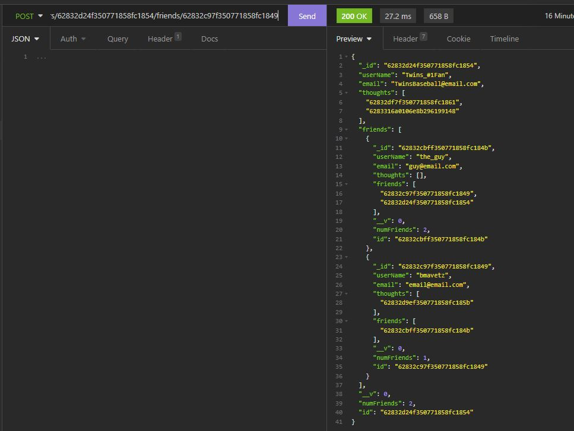

delete friend
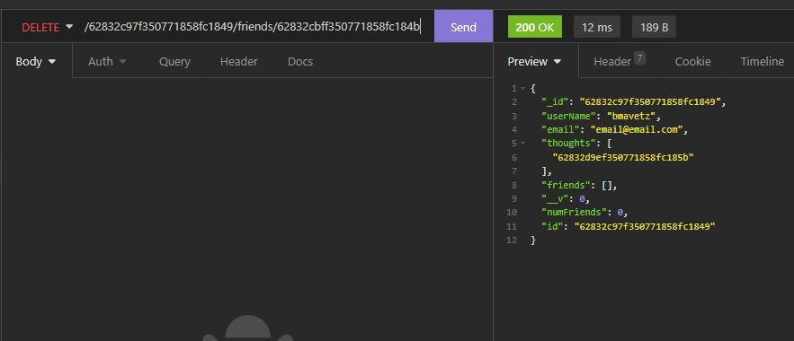

get thoughts
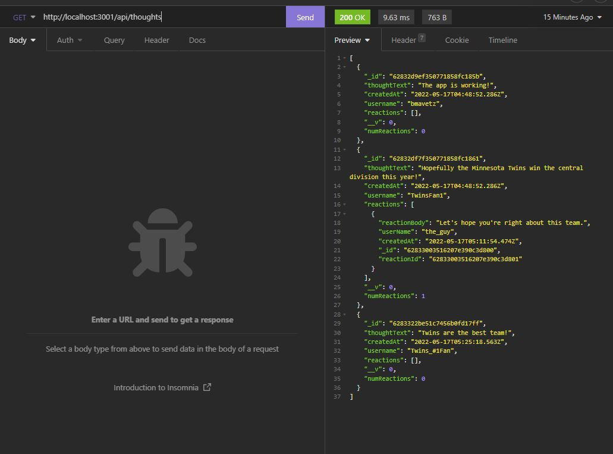

get single thought
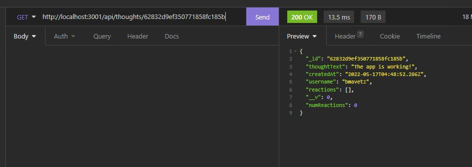

create thought
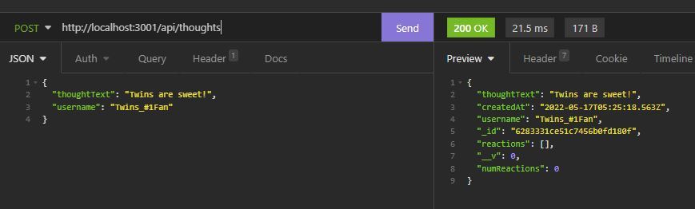

update thought
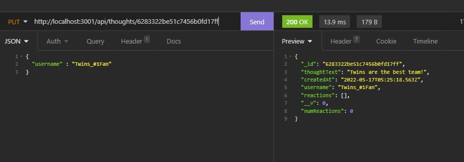

delete thought
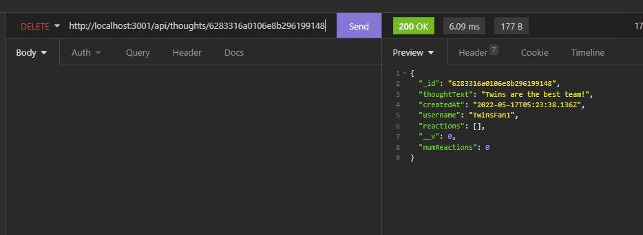

create reaction


delete reaction
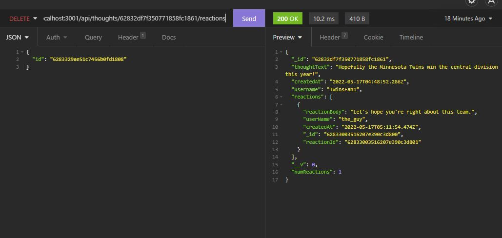

